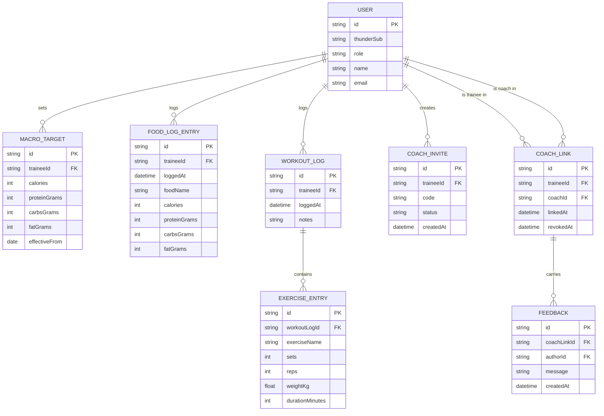

# Domain Model

The core entities behind macro and workout tracking, coach oversight and
feedback.

`USER` is a Trainee or a Coach, distinguished by `role`, both provisioned
through Thunder sign-in. A `COACH_LINK` is created when a Trainee's
`COACH_INVITE` is accepted, and carries the `FEEDBACK` a Coach leaves for that
Trainee. `MACRO_TARGET`, `FOOD_LOG_ENTRY` and `WORKOUT_LOG` (with its
`EXERCISE_ENTRY` children) all belong to the Trainee who logged them.