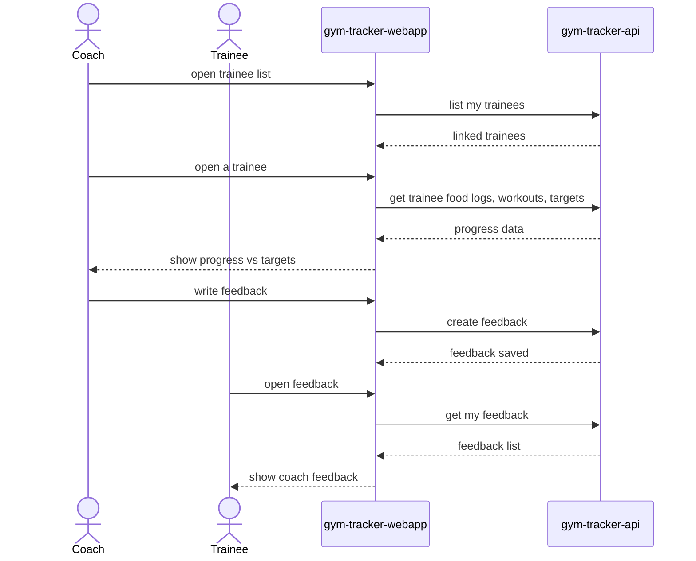

# Coach reviews a Trainee and leaves feedback

A Coach opens a linked Trainee's logs and progress, then leaves feedback the
Trainee later sees.

```mermaid
sequenceDiagram
    actor Coach
    actor Trainee
    participant webapp as gym-tracker-webapp
    participant api as gym-tracker-api

    Coach->>webapp: open trainee list
    webapp->>api: list my trainees
    api-->>webapp: linked trainees
    Coach->>webapp: open a trainee
    webapp->>api: get trainee food logs, workouts, targets
    api-->>webapp: progress data
    webapp-->>Coach: show progress vs targets
    Coach->>webapp: write feedback
    webapp->>api: create feedback
    api-->>webapp: feedback saved

    Trainee->>webapp: open feedback
    webapp->>api: get my feedback
    api-->>webapp: feedback list
    webapp-->>Trainee: show coach feedback
```

