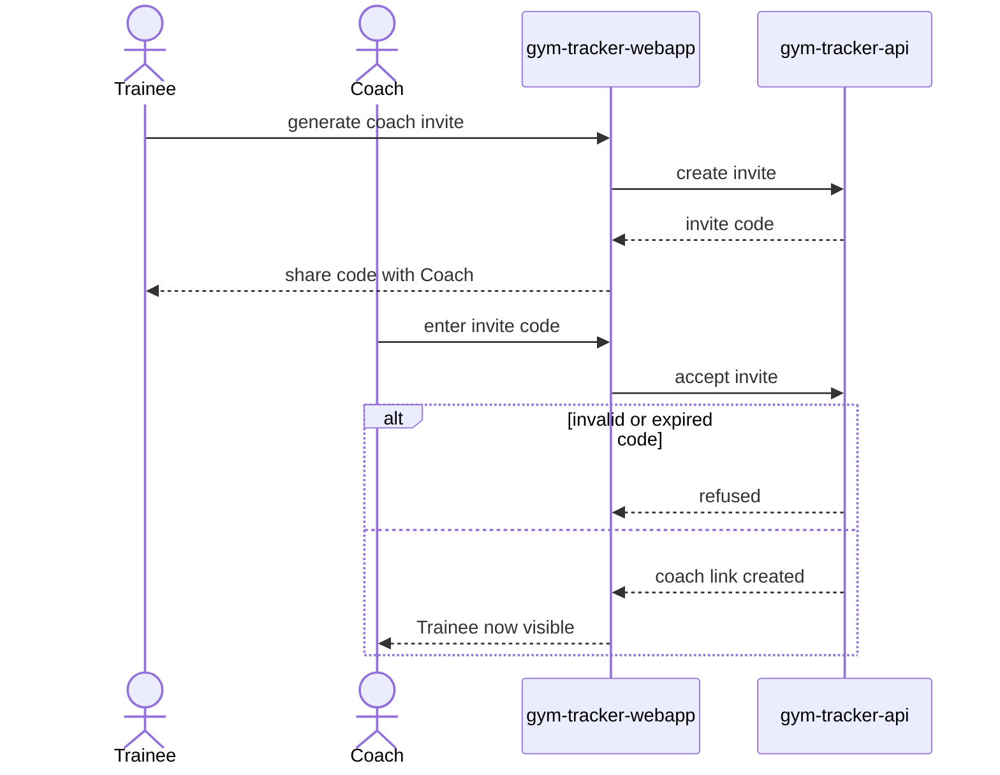

# Link a Coach to a Trainee

A Trainee generates an invite and a Coach accepts it, becoming linked and
gaining oversight of that Trainee's progress.

```mermaid
sequenceDiagram
    actor Trainee
    actor Coach
    participant webapp as gym-tracker-webapp
    participant api as gym-tracker-api

    Trainee->>webapp: generate coach invite
    webapp->>api: create invite
    api-->>webapp: invite code
    webapp-->>Trainee: share code with Coach

    Coach->>webapp: enter invite code
    webapp->>api: accept invite
    alt invalid or expired code
        api-->>webapp: refused
    else
        api-->>webapp: coach link created
        webapp-->>Coach: Trainee now visible
    end
```

