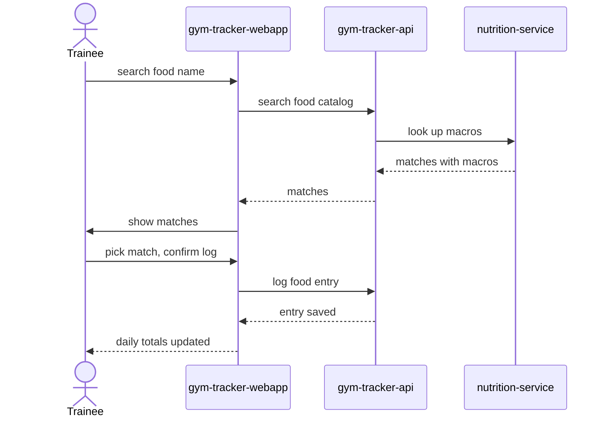

# Log a food with a nutrition lookup

A Trainee searches the nutrition database while logging a meal, then saves the
entry with its macros.

```mermaid
sequenceDiagram
    actor Trainee
    participant webapp as gym-tracker-webapp
    participant api as gym-tracker-api
    participant nutrition as nutrition-service

    Trainee->>webapp: search food name
    webapp->>api: search food catalog
    api->>nutrition: look up macros
    nutrition-->>api: matches with macros
    api-->>webapp: matches
    webapp->>Trainee: show matches
    Trainee->>webapp: pick match, confirm log
    webapp->>api: log food entry
    api-->>webapp: entry saved
    webapp-->>Trainee: daily totals updated
```

